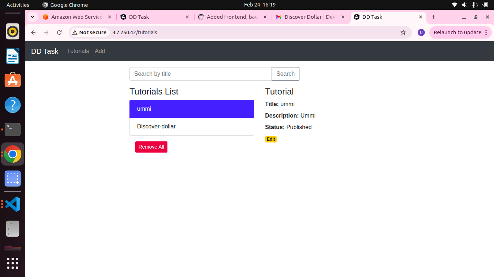
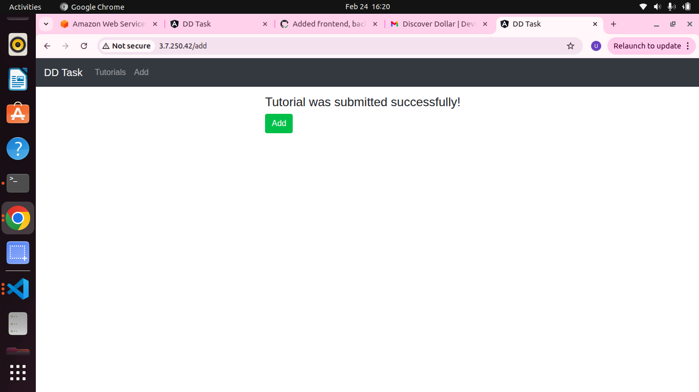
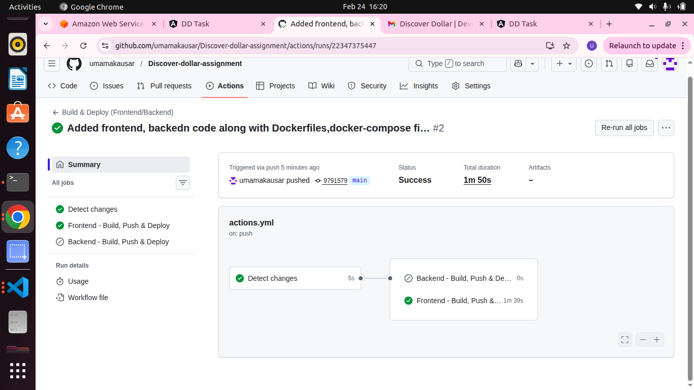
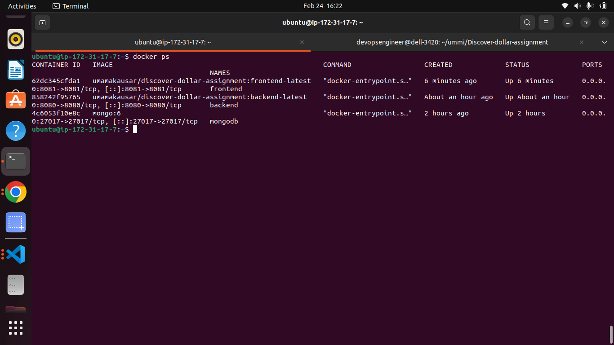

# 🚀 MEAN Stack Application – Containerized & CI/CD Deployed

## 📌 Project Overview


The application is deployed on an **Ubuntu EC2 (t3.medium)** instance using:

* Docker & Docker Compose
* Nginx Reverse Proxy
* GitHub Actions CI/CD
* Docker Hub Image Registry

---

# 🏗️ Repository Structure

After receiving the assignment code, I:

1. Created a new GitHub repository.
2. Moved the application into two folders:

```
root
 ├── frontend/
 ├── backend/
 ├── docker-compose.yml
 └── .github/workflows/
```

Each service contains its own Dockerfile.

---

# 🐳 Dockerization

## Backend Dockerfile

Location: `backend/Dockerfile`

* Node-based image
* Installs dependencies
* Exposes backend port (8080)

## Frontend Dockerfile

Location: `frontend/Dockerfile`

* Angular build stage
* Serves production build

Both images are pushed to Docker Hub:

* `umamakausar/discover-dollar-assignment:frontend-latest`
* `umamakausar/discover-dollar-assignment:backend-latest`

---

# 🗄️ MongoDB Configuration (Environment-Based)

To resolve MongoDB authentication and container networking issues, I modified:

📂 `backend/app/config/db.config.js`

```js
const user = encodeURIComponent(process.env.MONGO_USER || "");
const pass = encodeURIComponent(process.env.MONGO_PASS || "");
const host = process.env.MONGO_HOST || "mongodb";
const port = process.env.MONGO_PORT || "27017";
const db   = process.env.MONGO_DB || "crud_db";

module.exports = {
  url: `mongodb://${user}:${pass}@${host}:${port}/${db}?authSource=admin`
};
```

### Why this change?

* Avoid hardcoded DB credentials
* Allow runtime configuration
* Support Docker Compose service name networking (`mongodb`)
* Follow 12-factor app principles

Environment variables are passed via Docker Compose.

---

# 🐳 Docker Compose Setup

📂 `docker-compose.yml` (root directory)

Includes three services:

* frontend
* backend
* mongodb (official MongoDB image)

Application was tested locally using:

```
docker compose up --build
```

Verified:

* Frontend working
* Backend API accessible
* MongoDB connection successful

---

# 🌐 Nginx Reverse Proxy Setup

Installed Nginx on Ubuntu EC2:

```bash
sudo apt update
sudo apt install nginx -y
```

Created configuration:

📂 `/etc/nginx/sites-available/discover-dollar`

```nginx
server {
    listen 80;
    server_name _;

    location / {
        proxy_pass http://127.0.0.1:8081;
        proxy_http_version 1.1;
        proxy_set_header Host $host;
        proxy_set_header X-Forwarded-For $proxy_add_x_forwarded_for;
        proxy_set_header X-Forwarded-Proto $scheme;
    }

    location /api/ {
        proxy_pass http://127.0.0.1:8080;
        proxy_http_version 1.1;
        proxy_set_header Host $host;
        proxy_set_header X-Forwarded-For $proxy_add_x_forwarded_for;
        proxy_set_header X-Forwarded-Proto $scheme;
    }
}
```

Enabled configuration:

```bash
sudo ln -s /etc/nginx/sites-available/discover-dollar /etc/nginx/sites-enabled/
sudo nginx -t
sudo systemctl restart nginx
```

Application is accessible via:

```
http://3.7.250.42/
```

---

# 🔧 CORS Issue Resolution

Initially, CORS errors were encountered.

Frontend originally used:

```js
const baseUrl = 'http://localhost:8080/api/tutorials';
```

This was changed to:

```js
const baseUrl = 'api/tutorials';
```

### Why this fix works:

* Requests now route through Nginx
* Same-origin policy satisfied
* No direct browser-to-backend cross-origin call

CORS issue resolved successfully.

---

# 🔁 CI/CD Pipeline (GitHub Actions)

Single workflow handles both frontend and backend.

### Stage 1 – Detect Changes

* Detects whether `frontend/` or `backend/` was modified.

### Stage 2 – Build & Push

* Builds only the modified service image
* Pushes image to Docker Hub

### Stage 3 – Deploy

* SSH into EC2
* Pull latest image
* Restart only updated service using:

```bash
docker compose pull <service>
docker compose up -d --no-deps --force-recreate <service>
```

This ensures zero unnecessary restarts.

---

# ☁️ Infrastructure Details

| Component         | Details        |
| ----------------- | -------------- |
| Cloud             | AWS            |
| Instance Type     | t3.medium      |
| OS                | Ubuntu         |
| Container Runtime | Docker         |
| Orchestration     | Docker Compose |
| Reverse Proxy     | Nginx          |
| Registry          | Docker Hub     |
| CI/CD             | GitHub Actions |

---

# 📸 Screenshots Included

✔ Working application UI




✔ GitHub Actions workflow execution




✔ EC2 running containers


---
